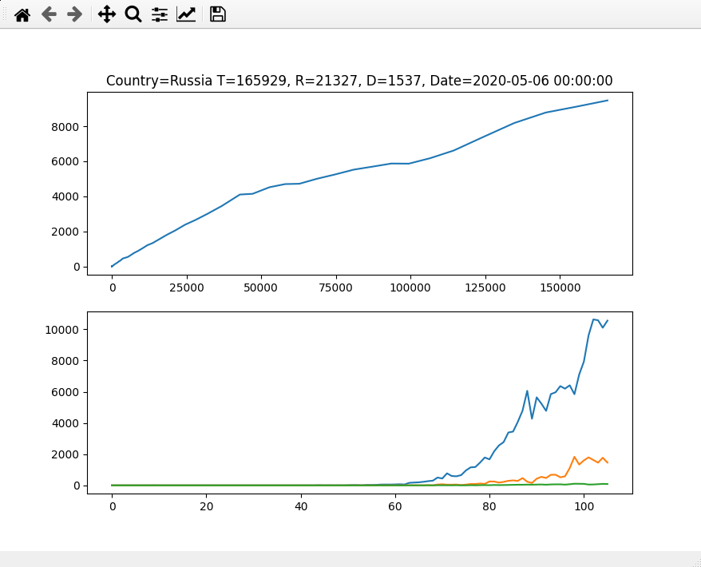

# Simple COVID charts based based CCSE data

Showing graph by country using CCSE dataset

Data provided by this repo https://github.com/datasets/covid-19

# Requierements

* Linux or OSX
* Python 3

# Run

`pip install -r requirements.txt`

`./build.sh CountryName`

# Example

# Credits

[CCSE data set https://github.com/datasets/covid-19](https://github.com/datasets/covid-19)
